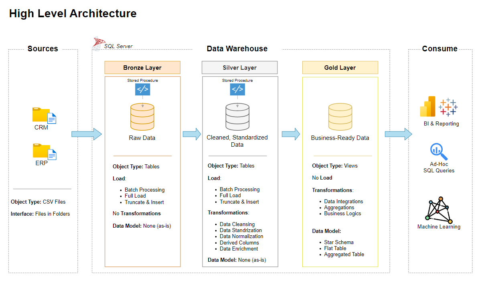

# Data Warehouse and  Analytics Project
Welcome to the **Data Warehouse and Analytics Projects** repository! 
This Project Demonstrates a comprehensive data Warehousing and analytics solution, from building a data warehouse to generating actionable insights. Designed as a portfolio project highlights indusrty best practicesin data engineeering and analytics.
## 🏗️ Data Architecture
The data architecture for this project follows Medallion Architecture **Bronze**, **Silver**, and **Gold** layers:

1. **Bronze Layer**: Stores raw data as-is from the source systems. Data is ingested from CSV Files into SQL Server Database.
2. **Silver Layer**: This layer includes data cleansing, standardization, and normalization processes to prepare data for analysis.
3. **Gold Layer**: Houses business-ready data modeled into a star schema required for reporting and analytics.

---
## 📖 Project Overview

This project involves:

1. **Data Architecture**: Designing a Modern Data Warehouse Using Medallion Architecture **Bronze**, **Silver**, and **Gold** layers.
2. **ETL Pipelines**: Extracting, transforming, and loading data from source systems into the warehouse.
3. **Data Modeling**: Developing fact and dimension tables optimized for analytical queries.
4. **Analytics & Reporting**: Creating SQL-based reports and dashboards for actionable insights.

🎯 This repository is an excellent resource for professionals and students looking to showcase expertise in:
- SQL Development
- Data Architect
- Data Engineering  
- ETL Pipeline Developer  
- Data Modeling  
- Data Analytics

---
# sql-datawarehouse-project
Designing a contemporary data warehouse using SQL Server, incorporating ETL processes, data modeling, and advanced data analytics.

--
## Project Requirements

### Building the Data Warehouse (Data Engineering)

#### Specificsations
- **Data Sources**: Import data from  two source systems (ERP and CRM) provide as CSV file.
- **Data Quality**: Cleanse and resolve Data Quality issues prior to analysis.
- **Integration**: Combine both source into a single, user-friendly data model designed for analytical queries.
- **Scope**: Focus on latest Dataset only; historization of data is not required .
- **Documentation**: Provide clear Documentation of the data  =model to support both business stakeholders and analytics team.
--- 
### BI: Analytical & Reporting (Data Analytics)

#### Objective
Develope SQL-based Analytics to deliver detailed insights into :

- **Customer Behavior**
- **Product Perfomance**
- **Sales Trends**

This insights empower stakeholders with Keybuisness metrics, enabling strategic decision-making.

---

